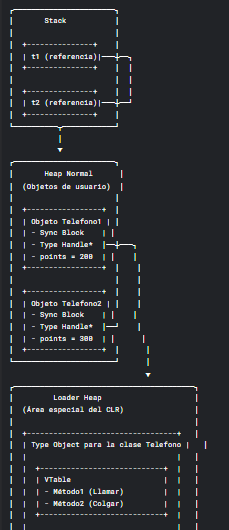

## conferencia #2: Memoria

```python
class Animal:
    def Accion(self):
        print("No hace nada")

class Leon(Animal):
    def Accion(self):
        print("Goar, Goar")

class Pato(Animal):
    def Accion(self):
        print("Cuac,cuac")


Patos = [Pato(), Pato(), Pato(),Pato()] #lista con 4 patos
Leons = [Leon(),Leon(),Leon(),Leon()]  #lista con 4 leones
animales = Patos        # comparten el mismo espacio de memoria
Patos[3] = Leon()      # modificamos el valor del 4to pato
animales[3].Accion()   #llamamos al metodo compartido

#Output : Goar,Goar
```

es por referencia

### C#

```csharp
Telefono t1 = new Telefono(200);
Telefono t2 = new Telefono(300);
```

1. Se guarda en la pila las referencias ( `t1`  y ` t2`) que generalmente ocupan unos 4 bytes u 8 bytes . Solo contiene la direccion de memoria donde esta cada objeto real en el heap
2. Se gaurda en el heap  el objeto real (con sus datos). Cada objeto contiene una cabecera (que contiene un puntero a su tipo y ese tipo contiene la vtable compartida )
3. La vtalbe se guarda en un espacio aparte llamado el Loader Heap (area especial del CLR)



### Python

```python
telf1 = Telefono(200)
telf2 = Telefono(300)
```

1. Solo almacena las referencias `telf1` y `telf2` que son punteros a objetos
2. En el heap se almacena cada objeto con cabecera del objeto, atributso de instancia
3. Los metodos se almancena en el diccionario de la clase , donde cada clase tiene un `__dict__` que contiene todos los metodos ( como una vtable)
4. Cuando llamas a `telf1.Llamar()`, se busca en el objeto `telf1.__dict__` , si no lo encuentra busca en la clase `telefono.__dict__` , si no esta sigue el curso de la herencia


## Conferencia 3: Formas de procesamiento

### Compilado a Codigo Nativo (Varias pasadas)

1. EL compilador traduce todo el codigo fuente a lengauje maquina `especifio para una arquitectura`
2. Suele tener mutiples fases (lexico, sintactico, optimizaciones)
3. Genera un ejecutable binario independiente
4. Maximo rendimiento
5. No necesita runtime adicional
6. `C/C++, Rust, Fortran, Go`

### Interpretado-Ejecutado Directamente del Codigo Fuente

1. EL interprete lee y ejecuta linea por linea
2. No hay fase de compilacion previa
3. EL codigo fuente puede ejecutarse en cualquier plataforma con el interprete
4. Mayor portabilidad
5. Mas lento que los compilados
6. Permite caracterisitcas dinamicas(eval, modificar codigo en ejecucion)
7. `Python, JavaScript, Ruby, Bash/Shell Scripting`

### Compilado a Codigo Intermedio + Maquina Virtual

1. Compilador traduce a bytecode intermedio
2. maquina virtual (JWM, CLR) ejecuta el bytecode
3. Suele incluir JIT (compilacion Just-In-Time)
4. Balance entre rendimiento y portabilidad
5. Recoleccion de basura automatica
6. Verficiacion de tipos en tiempo de ejecucion
7. `Java(compilado a bytecode ejecutado por JWM) y C# (compilado a CIL, ejecutado por CRL), Kotlin (compila a JWM como Java)`

### Compilado a Lenguaje Intermedio - Generacion de Codigo Nativo

1. Primera Fase: Compilacion a IR
2. Segunda Fase: Generacion de codgio nativo especfico
3. Pemite optimizaciones avanzadas
4. Alto rendimiento cercano a nativo
5. soporte mutipltaforma (el IR es el mismo para todos)
6. Fase de compilacion mas compleja
7. `HULK, Swift , Rust (usa LLVM como backend), Haskell (ghc compila a c)`

## Conferencia 4: tipado estatico y dinamico

> El `Duck Typing` se basa en la idea de : Si camino como un pato y suena como un pato, etonces es un pato.
>
> En lugar de verificar tipos estaticamente, se comprueba en tiempo de ejecucion si u objeto puede hacer lo que se le pide

```python
class Pato:
    def graznar(self):
        print("¡Cuac!")

class Persona:
    def graznar(self):
        print("¡Imito un pato!")

def hacer_sonar(objeto):
    objeto.graznar()  # No importa el tipo, solo que tenga .graznar()

p = Pato()
h = Persona()

hacer_sonar(p)  # ¡Cuac!
hacer_sonar(h)  # ¡Imito un pato!
```

### Static Typing

> **Tú dices qué eres, y solo te puedo usar según lo que declaras**
>
> * **Declaras el tipo de una variable/clase/método explícitamente** (ej: `int x = 10;` en C#).
> * El compilador **verifica los tipos antes de ejecutar** (si no coinciden,  **error de compilación** ).
> * **Solo puedes usar** el objeto según lo que declaraste.

```csharp
// Declaras que "perro" es de tipo "Animal" (y solo tendrá métodos de Animal)
Animal perro = new Perro(); 
perro.Ladrar(); // ✅ Si "Animal" tiene el método .Ladrar()  
perro.Volar();   // ❌ Error en COMPILACIÓN si "Animal" no tiene .Volar()  
```

### Dynamic Typing

> **Tú eres lo que implementas, más libertad pero más riesgos**
>
> * El intérprete **solo verifica los tipos al ejecutar** (si no existe un método,  **error en runtime** ).
> * **Puedes usar cualquier método/propiedad** mientras exista en el objeto.

```python
def hacer_sonar(animal):
    animal.ladrar()  # No importa el tipo, solo que tenga .ladrar()

class Perro:
    def ladrar(self):
        print("¡Guau!")

class Pato:
    def graznar(self):
        print("¡Cuack!")

hacer_sonar(Perro())  # ✅ Funciona (tiene .ladrar())  
hacer_sonar(Pato())   # ❌ ERROR en RUNTIME (no tiene .ladrar())  
```

## Conferencia #5 : Arrays

Arrays: Expresan una secuencia "enumerada" (por lo general a partide 0) de valores de un mismo tipo que son accedidos no a traves de un nombre como en la composicion sino por su posicion numerica(indice) en la secuencia

#### C/C++

En C los arrays y los punteros estan estrechamnete relacionados, pero no son lo mismo:

```c
int arr[5] = {10, 20, 30, 40, 50};
printf("%d\n", *arr); // Imprime 10 (primer elemento)
```

- UN puntero es una varaible que almacena la direccion de la memoria, puede apuntar a aun array o a memoria dinamica reservada con malloc

```c
int *ptr = malloc(5 * sizeof(int)); // Puntero a un array dinámico
ptr[0] = 100; // Acceso como array
free(ptr); // Liberar memoria
```

#### C#

En c# los arrys y listas ocupan un espacio fijo ocupado en el heap, por no pueden crecer. Es responsabilidad ocuapar o acceder a los espacios. En el caso de una lista ,se crea un espacio predeterminadao y se copian los valores de este para el nuevo

#### Python

##### **Características:**

* **Dinámicas** : Pueden crecer o reducirse en tiempo de ejecución (`append()`, `pop()`, etc.).
* **Heterogéneas** : Pueden almacenar elementos de distintos tipos (enteros, strings, otras listas, etc.).
* **Implementación** : Internamente, son **arreglos de referencias** a objetos (no almacenan los datos directamente, sino punteros a ellos).
* **Modificables (mutables)** : Cambiar un elemento no crea una nueva lista.

```python
lista = [1, "hola", [2, 3], 4.5]
lista.append(10)  # Se puede modificar
```

```python
a = [1, 2, 3]
b = a  # 'b' es una referencia a la misma lista que 'a'
b[0] = 99
print(a)  # Output: [99, 2, 3] (¡Se modificó 'a' también!)
```

#### Formas de Traspaso de parametro

- Por copias: normal se crea una copia del valor
- Por resultado: No se pasa una copia del valor al llamar la funcion sino que el parametro formal actua como una variable local no inicializada, al finalizar la funcion el valor del parametro formal se copia de vueta al paraemtro real. En c# usar `out`
- Lazy Evaluation: Es una estrategia donde las xpresiones no se evaluan hasta que su vloar sea necesario. Se usa en : lenguajes funciones, parametros lambdas y optimizacion calculos costoss.

## conferencia 6: interfaces y genericidad

- range(n) en python se ejecuta primer en el ciclo, y no se comprueba de nuevo en cada iteracion
- covarianza: Permitir usar un tipo mas derivado donde se espera uno meno derivado(padre)

```csharp
object[] objetos = new string[3]; // Covarianza: string[] -> object []
objetos[0]= "Hola";
objetos[1] = 123; // ❌ Error en runtime (ArrayTypeMismatchException)
```

- contravarianza: Permite usar un tipo **menos derivado** (padre) donde se espera uno **más derivado** (hijo).

```csharp
Action<object> actObject = obj => Console.WriteLine(obj);
Action<string> actString = actObject; // Contravarianza: Action<object> → Action<string>
actString("Hola"); // Válido
```

- Invarianza: Cuando **no** se permite ni covarianza ni contravarianza. El tipo debe ser exacto.

```csharp
List<string> strings = new List<string>();
List<object> objetos = strings; // ❌ Error de compilación (List<T> es invariante)
```

## conferencia 7: herencia, interfaces y bindings

### **1. Estructura en Memoria**

Cuando una clase (ej: `Circulo`) implementa `IFigura`, ocurre lo siguiente:

#### **A. Tabla de Métodos Virtuales (VTable)**

* Cada tipo (clase o interfaz) en C# tiene una  **tabla de métodos virtuales (VTable)** .
* Esta tabla almacena **direcciones de memoria** de los métodos que el tipo puede ejecutar.
* Para interfaces, se usa una **tabla adicional llamada "Interface Map"** vinculada a la VTable principal de la clase( Apunta a la sección de la VTable donde están los métodos de la interfaz)

#### **2. ¿Qué va al *Heap* y qué a la  *Pila* ?**

* **Heap (Montículo)** :
  * **Objetos completos** (`new A()`, `new B()`).
  * **Campos de instancia** (`ValorA`, `ValorB`).
  * **Puntero a la VTable** (para resolver llamadas a métodos).
* **Stack (Pila)** :
  * **Variables de referencia** (`objA`, `objB`), que apuntan al objeto en el  *heap* .
  * **Parámetros de métodos** y variables locales.

```csharp
class A {
    public int ValorA;
    public void MetodoA() { Console.WriteLine("Método A"); }
}

class B : A {
    public int ValorB;
    public void MetodoB() { Console.WriteLine("Método B"); }
}

A objA = new A();

```

La memoria se organiza así:

| **Componente**      | **Ubicación** | **Contenido**                                                                     |
| ------------------------- | -------------------- | --------------------------------------------------------------------------------------- |
| **Heap**            | Almacena el objeto   | - Campos (`ValorA`) + Bloque de métodos (puntero a la **VTable** de `A`).    |
| **VTable de `A`** | Memoria estática    | - Direcciones de `MetodoA()` y métodos heredados (ej: `ToString()` de `Object`). |

```csharp
B objB = new B();
```

| **Componente**      | **Ubicación** | **Contenido**                                                                                                    |
| ------------------------- | -------------------- | ---------------------------------------------------------------------------------------------------------------------- |
| **Heap**            | Almacena el objeto   | - Campos de `A` (`ValorA`) + Campos de `B` (`ValorB`) + **VTable Ptr** (apunta a la VTable de `B`).    |
| **VTable de `B`** | Memoria estática    | -**Herencia de VTable** : Primero métodos de `A` (`MetodoA`), luego métodos nuevos de `B` (`MetodoB`). |

```csharp
Animal miAnimal = new Perro(); // Tipo estático: Animal, Tipo real: Perro
miAnimal.Comer(); // ✅ Llama a Perro.Comer() gracias a la VTable.
```

## 8- Programacion Funcional

### Coneceptro Claves de la Programacion Funcional

* **Funciones como ciudadanos de primera clase** : Pueden asignarse a variables, pasarse como argumentos y retornarse.
* **Inmutabilidad** : Los datos no cambian; se crean nuevos.
* **Funciones puras** : Sin efectos secundarios (mismo input → mismo output).
* **Expresiones Lambda** : Funciones anónimas y concisas.
* **Higher-Order Functions** : Funciones que reciben o retornan otras funciones.

```csharp
// Funciones Lambdas
Func<int, int, int> sumar = (a, b) => a + b;
Console.WriteLine(sumar(3, 5)); // 8
```

```csharp
// LINQ (Manipulacion de Datos Funcional)

var numeros = new List<int> { 1, 2, 3, 4 };
var pares = numeros.Where(n => n % 2 == 0).Select(n => n * 2);
// Resultado: [4, 8]
```

### Delegados

| Delegado                            | Descripción                                      | Uso Típico                     |
| ----------------------------------- | ------------------------------------------------- | ------------------------------- |
| **`Func<T1, T2, TResult>`** | Función con 2 parámetros y retorno.             | Cálculos, transformaciones.    |
| **`Action<T1, T2>`**        | Función con 2 parámetros**sin retorno** . | Métodos que ejecutan acciones. |
| **`Predicate<T>`**          | Función con 1 parámetro y retorno `bool`.     | Filtrado (ej:`List.FindAll`). |

```csharp
void ProcesarDatos<T1, T2, TResult>(T1 a, T2 b, Func<T1, T2, TResult> operacion) {
    TResult resultado = operacion(a, b);
    Console.WriteLine($"Resultado: {resultado}");
}

// Uso:
ProcesarDatos(10, 20, (x, y) => x + y); // Output: 30
```

```csharp
var numeros = new List<int> { 1, 2, 3 };
var textos = numeros.Select((num, index) => $"Número {num} en posición {index}").ToList();
// textos = ["Número 1 en posición 0", "Número 2 en posición 1", ...]
```

### Python y La Programacion Funcional

```python
// FUNCIONES LAMBDAS

sumar = lambda a,b: a+b
print(sumar(3,5)) #8

// FUnciones de orden superior
def aplicar_operacion(func,a,b):
	return func(a,b)

resultado = aplicar_operacion(lambda x,y : x*y, 4,5)
print(resultado) #20

numeros = [1, 2, 3, 4]
pares = list(filter(lambda x: x % 2 == 0, numeros))  # [2, 4]
duplicados = list(map(lambda x: x * 2, numeros))     # [2, 4, 6, 8]

// Listas Comprehensions (estilo funcional)
cuadrados = [x**2 for x in numeros]  # [1, 4, 9, 16]

```

- Importante tener en cuenta que trabajan bajo demanda( osea no crea un IEnumerable `<T>` )

| **Característica**    | **C#**                                 | **Python**                                |
| ---------------------------- | -------------------------------------------- | ----------------------------------------------- |
| **Soporte de FP**      | Híbrido (OOP + FP con LINQ).                | Más flexible y orgánico.                      |
| **Inmutabilidad**      | Registros (`record`), campos `readonly`. | Tuplas,`frozenset`.                           |
| **Expresiones Lambda** | Sintaxis más verbosa (`=>`).              | Sintaxis concisa (`lambda x: x + 1`).         |
| **Herramientas FP**    | LINQ,`Func<>`, `Action<>`.               | `map`, `filter`, `reduce`, `itertools`. |
| **Tipado**             | Estático (mejor soporte para FP genérica). | Dinámico (más flexible pero menos seguro).    |

## 9- Decoradores

**Decorador** : Patrón de diseño que envuelve una función/clase para agregar comportamiento adicional (ej: logging, timing, caching).

#### **Analogía** :

* **Python** : Un decorador es como un "wrapper" (envoltorio) que modifica una función.
* **C#** : Similar, pero se implementa con funciones lambda o clases.

### **. Decoradores en Python**

```python
def decorador(func): #-> recibe la funcion principal
    def wrapper(*args, ** kwargs):   #-> parametros de la funcion principal
	print("Antes de llamar ala funcion")
	result = func(*args, **kwargs)
	print("Despues de llamar a al funcion")
	return result
   return wrapper

@decorador
def saludar(nombre):
    print(f"Hola , {nombre}")

saludar("Juan")

// OUTPUT
//Antes de llamar a la función
//Hola, Juan
//Después de llamar a la función
```

```python
from functools import wraps

def memoize(f):
    cache = {}

    @wraps(f)
    def wrapper(*args, **kwargs):
        key = (args, frozenset(kwargs.items()))
        if key in cache:
            return cache[key]
        result = f(*args, **kwargs)
        cache[key] = result
        return result

    return wrapper

// FUncion memoize en python

@memoize
def sumar(int a ,int b):
	return a +b

sumar (2,3)

```

Si mi decorador recibiese paramtros entonces es necesario crear una funcion mas externa aun, que reciba esos dos parametros.

### Decoradores en C#

```csharp
// ASPECTP

Func<T, R> name <T,TResult> (Func<T,TResult> f);

// T Entrada de mi nuevo tipo de la func decoradora
// R Mi resultado de mi funcion decoradora

// f es la funcion  a ser decorada que recibe un entrada y devuelve un resultado
```

- decorar una funcion `f` de tipo (`Func<T,TResult>`) para agregar informacion extra determinado en R que es tipo de retorno de mi nueva funcion decoradora

```csharp
using System;

Func<int,int> Decorador(Func<int,int> func)
{
    return (int x) =>
    {
	Console.WriteLine("Antes de llamar a la funcion");
	int result = func(x);
	Console.WriteLine("Despues de llamar a la funcion");
	return result;  
    };
}


Func<int,int> Doblar = x=> x*2;

var DoblarDecorado = Decorador(Doblar);

Console.WriteLine(DoblarDecorado(5)); // 10
```

## 10- Dynamic C#

- `dynamic` es un tipo introducido en C# 4.0
- Permite desactviar la verificacion estatica de tipos en tiempo de compilacion y resolver operaciones en timepo de ejecucion
- Es decir, cuando usar una variable `dynamic`, el compilador no verifica que los metodos o propiedades existan. La comprobacion y la ejecucion se resuelven en tiempo de ejecucion
- Permite trabajar con objetos que no conoces hasta que se ejecuta el programa (por ejemplo, objetos COM, objetos JSON dinamicos, etc)

```csharp
dynamic d = "Hola";
Console.WriteLine(d.Length); // OK , Length existe en string

d= 123;
Console.WriteLine(d.Length); // No da error en compilacion, pero en ejecucion lanza RuntimeBinderExecption

```

### Cuando usar `dynamic` ?

- Cuando trabajas con APIs dinamicos (COM,JSON,XML)
- Para interoperar con lenguajes dinamicos (Python, JS)
- Para simplificar reflexion y acceso a objetos desconocidos
- Para facilitar la escritura de codigo flexible o prototipos rapidos

| Ventajas                       | Desventajas                                     |
| ------------------------------ | ----------------------------------------------- |
| Código más simple y flexible | Sin verificación estática de tipos            |
| Permite llamadas dinámicas    | Errores detectados solo en tiempo de ejecución |
| Útil para objetos dinámicos  | Menor rendimiento (binding en tiempo real)      |

### Clase DyanmicObject

- Es una clase base en `System.Dynamic` que permite crear objetos personalizados con coportamiento dinamico
- Al heredar de `DyanmicObject` , puedes controlar que pasa cuando se acceden a propiedades, metodos , indices
- Muy util para crear objetos que simulan ser dinamicos (por ejemplo , wrappers, proxies, objetos que cambian sus estrcutra en runtime)

### Metodo mas comunes de  `DyanmicObject`

* `TryGetMember(GetMemberBinder binder, out object result)`: controla la lectura de propiedades.
* `TrySetMember(SetMemberBinder binder, object value)`: controla la escritura de propiedades.
* `TryInvokeMember(InvokeMemberBinder binder, object[] args, out object result)`: controla la llamada a métodos.
* `TryGetIndex`, `TrySetIndex`: para acceso a índices (como arrays).
* Otros para operaciones aritméticas, conversión, etc.

```csharp
using System;
using System.Dynamic;
using System.Collections.Generic;

public class DynamicDictionary : DynamicObject
{

}

```
