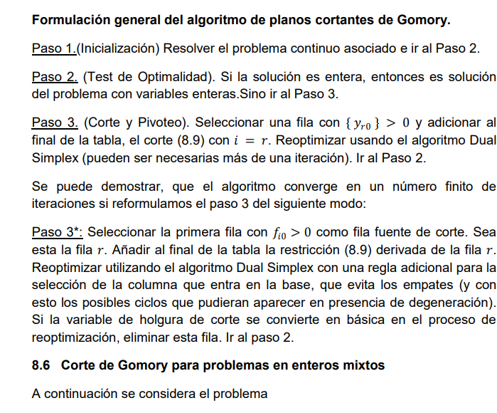

## Metodo de planos cortantes

1. Se usa para restricciones de enteros

2. El objetivo es agregar nuevas stricciones

3. Corte fundamental:

$ \sum_{j \in R} ([hy_{ij}]- [h]y_{ij})x_j \leq [~~hy~~_{i0}]- [h]y_{i0} $

Particularmente para h=1 se obtiene, `corte de Gomory`

$$\sum_{j \in R} ([y_{ij}]- y_{ij})x_j \leq y_{i0} - y_{i0}$$

Ok entonces se toma como criterio para elegir la fila fuente de corte , escogiendo al fila r con :

$$f_{r0}= max f_{i0}$$

$f_{ij} = y_{ij} - [y_{ij}]$

(es decir el r con el mayor parte fraccionaria)

4. Agregamos la restriccion nueva a la tabla anteriormente obtenida

5. Se puede demostrar que el algoritmo converge en un numeorfinito de iteraciones  si se reformula el proceso dela siguiente forma:

- Seleccionar la primera fila $f_{i0}$ como fial fuentede cort.  Sea esta la fila r, annadir al final de la tabla la restriccion derivada de  la fila 

El algoritmo para el caso mixto 
corresponde exactamente al formulado para el caso en enteros puro, pero se 
sustituye por el corte:

$$\sum{j \in R_1} f_{ij}x_j + \sum_{j in R_{2}^{+}}y_{ij}v_{j} - \frac{f_i0}{1-f_{i0}}\sum_{j \in R_{2}^{-}}y_{ij}v_{j} \geq f_{i0}$$