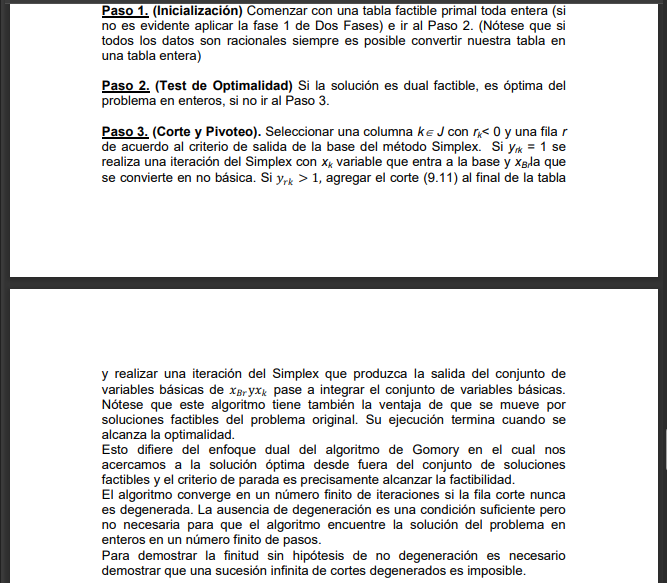

# Planos cortantes II

Variantes de algortimo de planos cortantes que garantizan que no se pierde el caracter entero de la solucion por tanto  eliminan la dificultad sennalada  los cortes de Gomory de utilizar como criterio de parada la comprobacion de que se ha alcanzdo una solucion entera.

### Algoritmo Dual Todo Entero

1. El objetivo es garantizar que el pivote correspondiente a una iteracion del algortimo Dual Simplex sea -1.
2. La idea que se utiliza es escoger un valor apropiado de h en al expresion del corte fundamental.

$$
\sum_{j \in R} ([hy_{ij}]- [h]y_{ij})x_j \leq [hy_{i0}]- [h]y_{i0}
$$

$$

$$

por tanto cualquier valor de h<1 que satifaga

$$
h \leq min_{j \in R_r} \frac{M_j}{y_{rj}} = h^*
$$

con $M_j = - [\frac{r_j}{r_k}]$ y $R_j$ los indices cuyas variables $y_{rj} < 0 $ y $r_k = min_{j \in R_r} r_j$. La expresion del corte finaliza siendo :

$$
\sum_{j \in R} [hy_{rj}]x_j  + x^h = [hy_{r0}]
$$

### Corte Primal Todo Entero

1. Se parte de una solucion factible en una tabla toda entera que no es dual factible (hay negativos en los $r_i$)
2. Si al intentar realizar una iteracion del metodo Simplex el pivote es 1, se realiza una iteracion comun del Simplex.
3. Si $y_{rk} = 1$ se procede normal como el simpelx. Si es mayor que 1 se construye una restriccion valida para S que consituya un corte de modo que le pivote al aplicar el SImplex sea 1, en lugar de $y_{rk}$

Para ello se susituye en la expresion del corte fundamental $h=\frac{1}{y_{rk}}$, se tiene:

$$
\sum_{j \in R} [\frac{y_{ij}}{y_rk}]x_j \leq [\frac{y_{i0}}{y_{rk}}]
$$

Al estandarizar la desigualdad se tiene:

$$
s + \sum_{j \in R} [\frac{y_{ij}}{y_rk}]x_j \leq [\frac{y_{i0}}{y_{rk}}]
$$

s entera no negativa.

5. Se usa cuando trabjamos con el metodo de las dos fases de simplex (con variables auxiliares)
