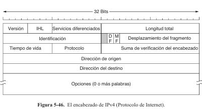
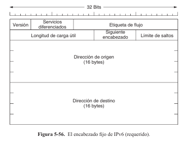

- `localhost : 127.0.0.1 (IPv4)`
- `::1 (IPv6)`
- `0.0.0.0 : todas las interfaces de red disponibles`

# Consideraciones generales

|                                             Capa                                             | Protocolos                                                                                  | Servicios que ofrece                                                                                                                                                                 | Funciones                                                                                                                                                                                                                                                                              |
| :------------------------------------------------------------------------------------------: | ------------------------------------------------------------------------------------------- | ------------------------------------------------------------------------------------------------------------------------------------------------------------------------------------ | -------------------------------------------------------------------------------------------------------------------------------------------------------------------------------------------------------------------------------------------------------------------------------------- |
|  [Fisica](C:\Users\HP\Documents\GitHub\REST_API_CLIENT\privated\redes\redes\1-capa-fisica.md)  | No hay "protocolos", solo estándares que definen cómo se transmite la señal en el medio | -                                                                                                                                                                                    | 1. Transmisión y Recepción de Bits 2. Definición de los Medios de Transmisión 3. Métodos de Codificación y Modulación 4. Definición de la Velocidad y el Ancho de Banda 5. Control de la Señal y Sincronización 6. Topologías y Conectores  |
|         [Enlace](C:\Users\HP\Documents\GitHub\REST_API_CLIENT\privated\redes\enlace.md)         |                                                                                             | - servicios sin conexion ni confirmacion de recepcion - servicios sin conexion con confirmacion de recepcion - servicio orientado a conexion con confirmacion de recepcion | 1. Transfmitir los bits a la maquina de destino                                                                                                                                                                                                                                        |
| [Control Acceso](C:\Users\HP\Documents\GitHub\REST_API_CLIENT\privated\redes\subcapa_acceso.md) |                                                                                             |                                                                                                                                                                                      |                                                                                                                                                                                                                                                                                        |
|            [Red](C:\Users\HP\Documents\GitHub\REST_API_CLIENT\privated\redes\red.md)            |                                                                                             |                                                                                                                                                                                      |                                                                                                                                                                                                                                                                                        |
|     [Transporte](C:\Users\HP\Documents\GitHub\REST_API_CLIENT\privated\redes\transporte.md)     |                                                                                             |                                                                                                                                                                                      |                                                                                                                                                                                                                                                                                        |
|     [Aplicacion](C:\Users\HP\Documents\GitHub\REST_API_CLIENT\privated\redes\aplicacion.md)     |                                                                                             |                                                                                                                                                                                      |                                                                                                                                                                                                                                                                                        |

# Capa Enlace

## Servicios proporcionados a la capa de red

- **Servicio sin conexión ni confirmación de recepción**
  - la máquina de origen envíe tramas independientes a la máquina de destino sin que ésta confirme la
    recepción
  - No se establece una conexión lógica de antemano ni se libera después
  - Si se pierde una trama debido a ruido en la línea, en la capa
    de datos no se realiza ningún intento por detectar la pérdida o recuperarse de
    ella
  - Trafico en timepo real, como voz , ethernet es el ejemplo.
- **Servicio sin conexión con confirmación de recepción**
  - tampoco se utilizan conexiones lógicas
  - se confirma de manera individual la recepción de cada trama
    enviada, si pierde o llega bien.
  - útil en canales no confiables, como los de los sistemas inalámbricos. 802.11
    (WiFi)
- **Servicio orientado a conexión con confirmación de recepción:**
  - el servicio más sofisticado que puede proveer la capa de enlace de datos a la capa de red
  - las máquinas de origen y
    de destino establecen una conexión antes de transferir datos
  - Cada trama enviada a través de la conexión está numerada, y la capa de enlace de datos
    garantiza que cada trama enviada llegará a su destino
  - Es apropiado usarlo
    en enlaces largos y no confiables, como un canal de satélite o un circuito telefónico de larga distancia.

## Entramado

- Algunos bits pueden tener distintos valores y la
  cantidad de bits recibidos puede ser menor, igual o mayor que la cantidad de bits
  transmitidos.
- Es responsabilidad de la capa de enlace de datos detectar y, de ser
  necesario, corregir los errores.
- El método común es que la capa de enlace de datos
  divida el flujo de bits en tramas discretas, calcule un token corto conocido como suma
  de verificación para cada trama, e incluya esa suma de verificación en la trama al
  momento de transmitirla.
- Cuando una trama llega al destino, se recalcula la suma de
  verificación. Si la nueva suma de verificación calculada es distinta de la contenida en
  la trama, la capa de enlace de datos sabe que ha ocurrido un error y toma las medidas
  necesarias para manejarlo

### Metodos de entramado

- **Conteo de bytes**
  - se vale de un campo en el encabezado para especificar el
    número de bytes en la trama
  - de esta forma la capa de enlace del destino sabe cuantos bytes siguen y por ende donde termina la trama
  - si hay un error de sincronia , sera imposible saber donde empieza la trama
  - ni siquiera con al suma de verificacion correcta
- **Bytes banderas con relleno de bytes :**
  - evita el problema de volver a sincronizar
    nuevamente después de un error al hacer que cada trama inicie y termine con
    bytes especiales
  - Con frecuencia se utiliza el mismo byte, denominado byte bandera, como delimitador inicial y final
  - Se puede dar el caso de que el byte bandera aparezca en los datos, en
    especial cuando se transmiten datos binarios como fotografías o canciones
  - Al interferir con el entramado, lo que se usa es insertar un byte de escape especial (ESC) antes de cada byte bandera "accidental"
  - Esta técnica se llama relleno de
    bytes.
- **Bits bandera con relleno de bits:**
  - Ya no es necesario usar obligatoriamente bytes bandera
  - Las tramas pueden contener un numero arbitrario de bits.
  - Cada trama empieza y termina con un patron de bits especial
  - Cada vez que el emisor encuentra 5 bits 1's inserta un 0 automaticamente como relleno en el flujo de bits de salida.
  - Analogo al relleno de bytes bandera
  - La tecnologia USB usa relleno de bits por esta razon
- **Violaciones de codificación de la capa física**
  - Evita la necesidad de añadir bytes adicionales para marcar tramas
  - Permite una detección rápida del inicio y fin de las tramas.
  - **Reduce la sobrecarga en la transmisión** en comparación con otros métodos.
  - **No interfiere con los datos normales** , ya que usa señales que nunca aparecerían en ellos

### Control de errores

# Subcapa de Control de Acceso al Medio

## Protocolos de Acceso al Medio

- **ALOHA**

  - Cada estacion transmite si tiene datos que enviar a una estacion central
  - Se retransmiten los datos desde la estacion central a las secundarias
  - Si una estación recibe una confirmación de que su trama llegó correctamente, continúa. Si la trama sufrió una colisión, la estación debe retransmitirla
  - El tiempo de retransmisión es **aleatorio** para evitar que las tramas se colisionen repetidamente en sincronía
- **ALOHA RANURADO**

  - Divide el tiempo en intervalos discretos o ranuras.
  - Las estaciones esperan al inicio de una ranura para enviar su trama
  - Al existir una colision , cada dispositivo espera un tiempo aleatorio antes de intentar retransmitir de nuevo
- **1-persistent CSMA:**

  - Cuando una estacion quiere transmitir , escucha primero el canal para ver si esta ocupado o libre
  - Si el canal esta inactivo , la estacion transmite con probabilidad de 1
  - Si el canal esta ocuado, espera que se libere para transmitir
  - Despues de una colision se espera un tiempo aleatorio antes de volver a intentar transmitir
- **CSMA no persistente**

  - Esucha primero al canal para transmitir
  - Si esta inactivo la estacion transmite los datos de inmediato
  - Si esta ocupado, la estacion espera un tiempo aleatorio antes de volver a intentar esuchar el canal
- **p-persistent CSMA**

  - Medio con intervalos de tiempo
  - Escucha el canal primero
  - Si esta libre , la estacion no transmite inmediatamente , sino que lo hace con una probabilidad de p y con una probabilidad de 1-p se pospone la transmisiion hasta el proximo intervalo
  - Si oucrre una colision espera un intervalo de tiempo aleatorio y comienza de nuevo
- **CSMA/CD**

  - Usado en Ethernet
  - Esucha el canal primero
  - Si esta libre comienza a transmitir inmediatamente
  - Si una estacion detecta que su transmision ha colisionado, detiene su transmision de inemediato para no seguir ocupando el canal
  - Espera un tiempo aleatorio
  - Mientras en ALOHA se sigue enviando la trama
- **Protocolo de mapa de bit:**

  - El tiempo se divide en N ranuraas de contencion, una para cada estacion
  - Durante la j-esima ranura solo al estacion j puede transmitir un bit: un 1 si quiere transmitir , sino un 0.
  - Despues de eso, cada estacion sabe qu estacion quiere transmitir y lo hacen de forma ordenada
- **Paso de Token:**

  - Se usa un mensaje especial llamado token que se pasa de una estacion a otra en un orden predefinido
  - Si una estacion tiene una trama lo hace meintras tenga el token
  - Si no tiene nada que transmitir pasa el token
- **Conteo Ascendente Binario:**

  - Se selecciona en cada momento una estacion ganadora , asignadno direcciones binarias a las estaciones
- **Contencion Limitada:**

  - Usa lo mejor de los protocolos de contencion como el CSMA y los protocolos libres de colision

# Dispositivos

- **Repetidores** (capa fisica): Amplificar y reevniar las sennales fisicas.
- **Hub** (capa fisica): Conecta multiples dispositivos en una red de are local(LAN) . Opera en la capa física, y simplemente retransmite los datos a todos los dispositivos conectados sin tomar decisiones inteligentes.
- **Cables (Ethernet, fibra, medios inalambricos de capa fisica)**
- **Modems :** Convierte las sennales digitales a analogicas y viceversa. Esto es crucial en conexiones a Internet mediante líneas telefónicas o cable coaxial (por ejemplo, ADSL). **Capa fisica**
- **Antenas WIFI :** Los sistemas de acceso permiten la transmisión de señales de radio entre los dispositivos y la infraestructura de red. Las antenas amplían el rango de cobertura de una red inalámbrica.
- **Switches** (**capa de enlace**): conecta varios dispositivos dentro de una red local (LAN). Opera en la **capa de enlace de datos**. A diferencia de un hub, un switch puede leer las direcciones MAC (Media Access Control) de los dispositivos y enviar los datos solo al dispositivo correspondiente
- **Bridge (puente)** :**Función** : El puente conecta dos segmentos de una red y opera en la capa de **enlace de datos.** Puede filtrar el tráfico entre los segmentos según las direcciones MAC y segmentar la red para reducir el tráfico.. Se usa para dividir una red en segmentos más pequeños y mejorar la eficiencia.
- **NIC (Tarjeta de interfaz de red):** La tarjeta de red es un dispositivo que conecta un dispositivo final (como una computadora) a la red. Opera en la capa de enlace de datos y se encarga de la comunicación de la computadora con la red. Se instala en las computadoras y otros dispositivos finales. **Capa de enlace**
- **Router:** **(capa de red)** pero tmb interactua con la capa de enlace de datos. Se encarga de dirigir los paquetes de datos entre diferentes redes. Un router examina las direcciones IP y elige la mejor ruta para que los datos lleguen a su destino. Se usa para conectar redes diferentes, como una LAN a Internet o una LAN a otra LAN.

# Capa de red

- En IPv4 las direcciones son de 32 bits
- En IPv6 las direcciones son de 128 bits
- Se comunica con datagramas que contienen la direccion IP
- `255.255.255.255` direccion IP de broadcast utilizada para enviar paquetes a todos los dispositivos en la red sin conocer sus direcciones
- `0.0.0.0` representa esta red, es decri que esucha en todas las inetrfaces de red donde se encuentra
- `127.x.y.z` es localhost siendo la mas frecuente `127.0.0.1`
- **Mascara de subred:** Define qué parte de la dirección IP pertenece a la red y qué parte identifica el host.

## Servicios proporcionados a la capa de transporte

- Servicio sin conexion:
  - Los enrutadores deben encargarse solo de mover paquetes sin preocuparse por la confiabilidad
  - Los paquetes se envian sin conexion y no se reliza un seguimiento
  - La responsabilidad de controlar errores y flujo recae en los hosts
  - Protocolo IP  no establece una conexion antes de enviar los paquetes y cada paquete se enruta de forma independiente
- Servicio orientado a conexion:
  - Este modelo es mas cercano a la idea de un servicio orientado a conexion , donde la red establece una conexion antes de que los paquetes se envien
  - Se maneja el control de errores y flujo de manera centralizada
  - La idea es evitar la necesidad de elegir una nueva ruta para cada paquete enviado

## Algoritmos de enrutamiento

- **Estatico**
  - se calcula por adelantado, fuera de línea, y se descarga en los enrutadores al arrancar la red
- **Dinamico:**
  - cambian sus decisiones de enrutamiento para reflejar los cambios de topología y algunas veces también los cambios en el tráfico

Algortimos:

- **Vector de distancia:**
  - cada enrutador mantiene una tabla (es decir, un vector) que proporcione la mejor distancia conocida a cada destino y el enlace que se puede usar para llegar ahí.
  - Se intercambian informacion de los vecinos
- **Dijkstra:**
- **Inundacion:**
  - técnica de enrutamiento en la que cada paquete recibido se envía a todos los enrutadores vecinos, excepto al que lo recibió. Para optimizar duplicados se utilizan mecanismos como contador de saltos y registro de paquetes enviados
- **Estado de enlace:**
  - IS-IS y OSPF son los algoritmos de enrutamiento más utilizados dentro de las redes extensas y
    de Internet en la actualidad.
  - Se reconoce las direccion de los vecinos de su red ; se establece la metrica de distancia o de costo para cada vecino; se construye un paquete que indique todo lo que acaba de aprender; envia ese paquete al resto de enrutadores usando inundacion; finalmente calcula la ruta mas corta usando Dijkstra.
- **Enrutamiento jerarquico:**
  - Organiza la red en regiones o niveles para reducir el tamano de las tablas de enrutamient
- **Enrutameinto por difusion (broadcasting):**
  - un mensaje se envia simultaneamente a varios o todos los hosts en uan red.
- **Enrutamiento mutifusion( multicasting)**
  - Enviar paquetes a grupos especficos en una red
- **Enrutamiento anycast**
  - Enivar paquetes al miembro mas cercano

## Protocolos de control de Internet

- **ICMP: protocolo de mensjae de control de Internet**
  - Hosts y routers para compartir informacion a nivel de capade red entre ellos
  - `ping` y `traceroute` son comandos basados en ICMP
  - Ejemplo de mensajes: `Time Exceded` (el tiempo de vida de un paquete es 0), `Destination unreachable` (unrutador no puede entregar un paquete a su destino), `Redirect` (Un enrutador indica al host emisor que actualice su tabla de rutas con una mejor ruta disponible.)
- **ARP : Protocolo de Resolucion de Direcciones**
  - Protocolo de red que traduce las direcciones `IP` en direcciones `MAC`.
  - Este protocolo es esencial en redes como Ethernet, donde las tarjetas de interfaz de red (NIC) utilizan direcciones físicas únicas de 48 bits, y no entienden las direcciones IP directamente.
  - Direccion MAC de difusion (`FF:FF:FF:FF:FF:FF`) y se usa una cache ARP para futuras transmisiones
  - Primero siempre se revisa si la direccion IP del mensaje a transmitir esta en la red usando al mascara de subreed, si no lo esta se envia al route (que es el gateway predeterminada)
- **DHCP: (Protocolo de Configuracion Dinamica de HOST)**
  - permite asignar automaticamente configuraciones esenciales de red como direcciones IP a los dispositivos en una red, eliminando la necesidad de configurar manualmente a cada equipo.
  - Se hace uso cuando un dispositivo tiene un direccion MAC (en su NIC ) pero no tiene una direccion IP en al red, tiene entonces que emitir un mensaje DHCP para obtener una direccion IP

## Protocolos de enrutamiento

- **RIP (Routing Information Protocol)**
  - Protocolo de enrutamiento dinamico (dentro de una misma red)
  - Utiliza algoritmos de distancia de vecino mas corto (SPF) para calcular las rutas más eficientes entre los nodos de la red
  - Utiliza el algoritmo de Bellman-Ford, vectores de distancia y saltos para calcular la ruta mas eficiente (no es lo mas eficiente)
  - Se envian las tablas de ruta completas las cuales se actualizan utilizando broadcast.
- **OSPF (Open Shortest Path First):**
  - Enrutamiento Dinamico (operan dentro de una misma red)
  - utiliza el algoritmo SPF para calcular las rutas más eficientes.
  - utiliza un enfoque de estado de enlace, donde cada router mantiene una tabla de estado de enlace que describe el estado de los enlaces a otros routers.
  - Utiliza el algoritmo de Dijkstra
  - Demanda mas procesamiento de CPU.
- **BGP (Border Gateway Protocol):**
  - Enrutamiento Externo (diferentes redes en Internet)
  - utiliza un enfoque de política de enrutamiento basado en políticas de acceso y preferencias de ruta para determinar las rutas más eficientes para el tráfico entre ssitemas autonomos

## NAT (network adddress translation)

- traduce direcciones IP internas privadas en una direccion IP publica para comunicarse con Internet
- Se utiliza el campo **puerto de origen** del encabezado TCP/UDP para identificar la conexión original, evitando conflictos si varios dispositivos internos usan el mismo puerto.
- La caja NAT consulta su tabla de traducción para identificar el dispositivo interno correspondiente y reescribe la dirección IP de destino al reenviar el paquete.

## IPv4

20 bytes fijos y 12 bytes opcionales

- Version(4 bits): INdica la version del protocolo, con la version 4 como la mas utilizada. IPv6 es la siguiente
- IHL (Internet Header Lenght - 4 bits) : Especfica la longitud del encabezado en palabras de 32 bits. El valor minimo es 5 y el maximo es 15 lo que limita el encabezado a 60 bytes.
- Servicios diferenciados (6bits ): Originalmente destinado a priorizar diferentes clases de servicio (por ejemplo, voz o transferencia de archivos), este campo ha cambiado de nombre y ahora se utiliza para marcar el paquete con una clase de servicio y gestionar la congestión.
- Longitud Total (16 bits): Indica el tamaño total del datagrama (encabezado + datos), con un límite de 65,535 bytes
- Identificacion ( 16 bits): Usado para identificar fragmentos de un datagrama y asegurar que pertenezcan al mismo paquete.

* **Suma de verificación del encabezado (16 bits):** Se utiliza para detectar errores en el encabezado mientras el paquete viaja por la red. El algoritmo suma todas las
  medias palabras de 16 bits del encabezado a medida que vayan llegando, mediante el uso de la aritmética de complemento a uno, y después obtiene el complemento a uno del resultado. Para los fines de este
  algoritmo, se supone que la Suma de verificación del encabezado es cero al momento de la llegada. Dicha
  suma de verificación es útil para detectar errores mientras el paquete viaja por la red. Tenga en cuenta que
  se debe recalcular en cada salto, ya que por lo menos hay un campo que siempre cambia (el campo Tiempo
  de vida), aunque se pueden usar trucos para agilizar ese cálculo
* **Desplazamiento del Fragmento (13 bits):** Indica la posición del fragmento dentro del paquete original, permitiendo la reconstrucción del datagrama.
* **Tiempo de Vida (TTL - 8 bits):** Contador que limita la vida útil del paquete en la red. En cada salto, este valor disminuye hasta que llega a cero, momento en el cual el paquete se descarta.
* **Protocolo (8 bits):** Especifica el protocolo de capa superior, como TCP o UDP.
* **Dirección de Origen (32 bits):** Dirección IP del origen del paquete.
* **Dirección de Destino (32 bits):** Dirección IP del destino del paquete.
* **Opciones (Variable):** Permite incluir características adicionales, como seguridad, enrutamiento estricto o libre, y registro de ruta.

# Capa de transporte

## Sockets

un `socket` es un punto final de comunicacion en una red. La API de sockets proporciona un conjunto de primitivas para crear, gestionar y cerrar conexiones de red.

Las principales primitivas de socket para TCP son:

* **SOCKET** : Crea un nuevo socket.
* **BIND** : Asocia una dirección (IP y puerto) al socket.
* **LISTEN** : Marca el socket como listo para aceptar conexiones.
* **ACCEPT** : Acepta conexiones entrantes.
* **CONNECT** : Inicia una conexión activa con un servidor.
* **SEND** / **RECEIVE** : Envía y recibe datos.
* **CLOSE** : Cierra la conexión.

## Puertos

`Puerto` se usa para identificar un servicio o aplicacion especfica en una maquina dentro de una red. Los puertos permiten que diferentes aplicaciones en una misma maquina se comuniquen con otras maquina a traves de una reed, sin que haya conflicto entre ellas.

> 💡 **NOTA**: cualquier numero entre 1024 y 65535 funcionara como puerto; los puertos por debajo de 1023 estan reservados para los usuarios privilegiados

##### Resumen del funcionamiento:

1. El **cliente** envía una solicitud al asignador de puertos (portmapper) para obtener la dirección TSAP del servicio que busca.
2. El asignador de puertos devuelve la dirección TSAP del servicio solicitado.
3. El cliente establece una conexión con el servidor especificado a través del TSAP proporcionado.
4. El servidor gestiona la conexión para procesar la solicitud del cliente.

## 3-way handshake

El 3-way handshake es un proceso que se utiliza en las conexiones TCP (Transmission Control Protocol) para establecer una conexión entre dos hosts en una red. Este proceso garantiza que ambos hosts estén listos para la comunicación y que se hayan establecido correctamente los parámetros necesarios para la transmisión de datos. El 3-way handshake consta de tres pasos principales:

1. **SYN (Sincronización)**: El primer paso es que el host que desea iniciar la conexión (el cliente) envía un paquete SYN al host con el que desea comunicarse (el servidor). Este paquete contiene un número de secuencia inicial (ISN) que el cliente elige al azar.
2. **SYN-ACK (Sincronización-Acknowledgement)**: En respuesta al paquete SYN, el servidor envía un paquete SYN-ACK al cliente. Este paquete contiene su propio ISN y también un número de confirmación (ACK) que es el ISN del cliente más uno, indicando que está listo para recibir datos.
3. **ACK (Acknowledgement)**: Finalmente, el cliente envía un paquete ACK al servidor para confirmar que ha recibido el paquete SYN-ACK. Este paquete ACK contiene el número de secuencia inicial del cliente más uno, indicando que está listo para enviar datos.

Una vez que se completa el 3-way handshake, la conexión TCP está establecida y ambos hosts pueden comenzar a enviar y recibir datos.

## UDP (User Datagram Protocol)

Es un protocolo de transporte que se utiliza en las redes de computadoras para enviar datos de manera rápida y eficiente, sin establecer una conexión previa entre el emisor y el receptor, lo que lo hace más ligero y rápido que otros protocolos de transporte como TCP.

Las características básicas de UDP incluyen:

1. **Sin Conexión**: A diferencia de TCP, UDP no establece una conexión antes de enviar datos. Esto significa que no hay un proceso de handshake de tres vías (3-way handshake) para establecer la conexión. Los datos se envían directamente al receptor sin confirmar que el receptor está listo para recibirlos.
2. **Sin Control de Flujo**: UDP no implementa mecanismos de control de flujo, lo que significa que no regula la velocidad a la que se envían los datos para evitar sobrecargar al receptor. Esto puede llevar a la pérdida de paquetes si el receptor no puede procesar los datos a la misma velocidad que se envían.
3. **Sin Control de Congestión**: Al igual que TCP, UDP no tiene mecanismos incorporados para manejar la congestión de la red. Esto significa que UDP puede enviar datos a una velocidad que puede sobrecargar la red o el receptor, lo que puede resultar en la pérdida de paquetes.
4. **Sin Garantía de Entrega**: UDP no garantiza la entrega de los paquetes de datos. No hay confirmación de que los paquetes lleguen al destino, lo que significa que los paquetes pueden perderse durante la transmisión.
5. **Sin Orden de Entrega**: Los paquetes de datos enviados por UDP pueden llegar al receptor en un orden diferente al que fueron enviados. Esto es diferente de TCP, que garantiza que los paquetes se entreguen en el orden correcto.
6. **Simplicidad**: Debido a su naturaleza sin conexión y sin control de flujo, UDP es más simple que TCP. Esto lo hace adecuado para aplicaciones que requieren velocidad y eficiencia, como el streaming de video y audio, juegos en línea y servicios de tiempo real.

### Encabezados UDP

Consta de un encabezado de 8 bytes seguido de la carga util de datos:

- **Puerto de origen y destino (16 bits cada uno)**
- **Longitud (16)**
- **SUma de verificacion de UDP (16 bits)**

## TCP(Transmission Control Protocol)

Es un protocolo de transporte que se utiliza en las redes de computadoras para enviar datos de manera confiable y ordenada entre dos hosts. Proporciona una serie de servicios que garantizan la entrega de datos, incluyendo la confirmación de la entrega, el control de flujo, el control de congestión y la detección y corrección de errores.

Las características básicas de TCP incluyen:

1. **Conexión Orientada**: TCP establece una conexión entre el emisor y el receptor antes de que los datos puedan ser transmitidos. Esto se realiza mediante un proceso de handshake de tres vías (3-way handshake) que garantiza que ambos hosts estén listos para la comunicación.
2. **Control de Flujo**: TCP implementa mecanismos de control de flujo para evitar que un transmisor muy rápido sature a un receptor lento. Esto se logra mediante el uso de ventanas de control de flujo y números de secuencia para controlar la cantidad de datos que se pueden enviar sin una confirmación previa.
3. **Control de Congestión**: TCP tiene mecanismos incorporados para manejar la congestión de la red. Esto incluye el uso de temporizadores y la reducción de la tasa de transmisión cuando se detecta congestión, lo que ayuda a mantener la red eficiente y evitar la pérdida de paquetes.
4. **Garantía de Entrega**: TCP garantiza la entrega de los paquetes de datos. Utiliza números de secuencia y confirmaciones de entrega para asegurar que cada paquete llegue al destino y en el orden correcto. Si un paquete se pierde durante la transmisión, TCP tiene mecanismos para retransmitir el paquete.
5. **Orden de Entrega**: TCP garantiza que los paquetes de datos se entreguen en el orden en que fueron enviados. Esto se logra mediante el uso de números de secuencia y confirmaciones de entrega.
6. **Detección y Corrección de Errores**: TCP utiliza técnicas como el chequeo de paridad y el checksum para detectar errores en los datos transmitidos. Si se detecta un error, TCP puede corregirlo o, en algunos casos, retransmitir el paquete.
7. **Fiabilidad**: Debido a sus mecanismos de control de flujo, control de congestión, garantía de entrega y detección de errores, TCP es un protocolo de transporte confiable que es adecuado para aplicaciones que requieren la entrega segura y ordenada de datos.

### Encabezado TCP

- **Segmento TCP es la unidad de datos que TCP intercambia entre el emisor y el receptor**
- **Encabezados de 20 bytes**
- Maximo teorico de 65515 bytes
- **MTU (Maximum Transfer Unit)** : La **MTU** es el tamaño máximo de datos que un paquete puede transportar en una única transmisión sin fragmentarse, medido en  **bytes**

### **Pasos del Proceso de Conexión**

1. **El servidor espera conexiones**
   * Se ejecutan las primitivas `LISTEN` y `ACCEPT`, indicando que el servidor está a la espera de una conexión en un puerto específico.
2. **El cliente inicia la conexión**
   * Ejecuta la primitiva `CONNECT`, enviando un **segmento TCP con el bit SYN activado** para solicitar la conexión.
3. **El servidor responde**
   * Si el servidor está escuchando en el puerto solicitado, responde con un  **segmento SYN-ACK** , confirmando la recepción de la solicitud.
   * Si el servidor no está escuchando en el puerto, envía un segmento con el  **bit RST activado** , rechazando la conexión.
4. **El cliente confirma la conexión**
   * Responde con un  **segmento ACK** , finalizando el proceso de establecimiento de conexión.

📌 **Ejemplo de secuencia normal:**

* Cliente → Servidor: `SYN (SEQ = x)`
* Servidor → Cliente: `SYN-ACK (SEQ = y, ACK = x+1)`
* Cliente → Servidor: `ACK (SEQ = x+1, ACK = y+1)`
  ✅ **Conexión establecida, lista para la transferencia de datos.**

## FLujo de datos completo

### **Funcionamiento en la Capa de Transporte**

1. **Cliente y Servidor** :

* El servidor se vincula a un socket específico, que incluye su dirección IP y un número de puerto (por ejemplo, 192.168.1.10:80 para un servidor web).
* El cliente también crea un socket, generalmente usando un puerto efímero asignado por el sistema operativo (por ejemplo, 192.168.1.20:49152).

1. **Establecimiento de Conexión (en TCP)** :

* Cuando un cliente quiere conectarse a un servidor, envía un **SYN** (synchronize) al socket del servidor (192.168.1.10:80).
* El servidor responde con un **SYN-ACK** (synchronize-acknowledge), y el cliente responde con un **ACK** (acknowledge). Esto establece la conexión.

1. **Comunicación** :

* Una vez establecida la conexión, los datos se envían entre el cliente y el servidor a través de sus sockets.
* En TCP, los segmentos se numeran para garantizar el orden y la entrega correcta.
* En UDP, los datagramas se envían sin conexión, y no se garantiza su entrega.

1. **Cierre de Conexión (en TCP)** :

* Cuando la comunicación ha finalizado, la conexión se cierra mediante un proceso de terminación que involucra mensajes **FIN** y  **ACK** .

### **Ejemplo Práctico**

1. **Servidor Web** :

* Un servidor web escucha en el puerto 80. Tiene un socket vinculado a su dirección IP y puerto (ej. 192.168.1.10:80).

1. **Cliente** :

* Un navegador en un dispositivo cliente se conecta a la dirección IP del servidor usando el puerto 80.
* Al hacerlo, el navegador envía una solicitud HTTP a través de su propio socket, utilizando un puerto efímero (ej. 192.168.1.20:49152).
