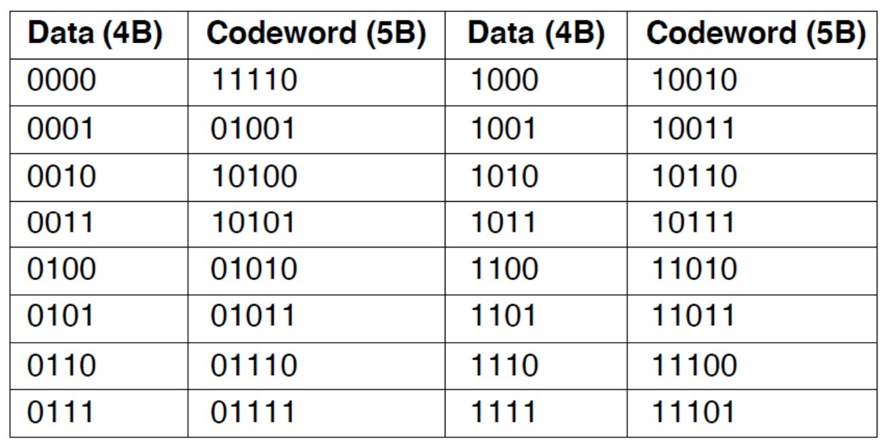
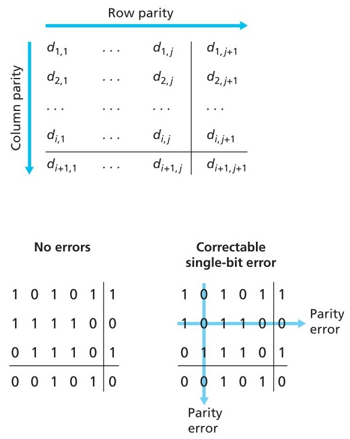

# Conferencia #2: Capa de enlace

La capa física se encarga de las especificaciones y procedimientos para la transmisión de datos a través de medios físicos, mientras que la capa de enlace de datos gestiona los marcos de datos y se encarga del control del flujo y de los errores, permitiendo la comunicación eficiente entre dispositivos en una red.

Esta capa normalmente se encuentra implementada en el adaptador de red también conocido como *network interface card (NIC)*. En el corazón de esta tarjeta normalmente se encuentra el controlador de capa de red que suele ser un único chip especializado que implementa muchas de las funcionalidades de la capa de enlace(framing, acceso a enlace, detección de errores...)

## Funciones de la capa de enlace

1. **Proveer de una interfaz bien definida de servicios para la capa de red**: Esta capa actúa como intermediario entre la capa de red y la capa física, facilitando la comunicación entre dispositivos en una red. Transforma los bits de datos de la capa de red en tramas que pueden ser transmitidas a través de la capa física 6.
1. **Delimitar la secuencias de bytes en frames bien definidos**: La capa de enlace de datos se encarga de encapsular los datos en tramas, que son bloques de datos con una estructura específica que incluye información como la dirección de origen y destino (dirección MAC), la longitud de los datos y un campo de verificación de errores (CRC). Esto permite que los datos sean transmitidos de manera organizada y eficiente 6.
1. **Detectar y corregir errores de transmisión**: Utiliza el campo de verificación de errores (CRC) para detectar si los datos han sido alterados durante la transmisión. Si se detecta un error, la trama puede ser retransmitida o descartada, dependiendo de la política de manejo de errores implementada 6.
1. **Regular en flujo de los datos de forma tal que remitentes rápidos no ahogen a receptores lentos**: La capa de enlace de datos implementa mecanismos de control de flujo para evitar que un transmisor muy rápido sature a un receptor lento. Esto se logra mediante el uso de señales de control que indican al receptor cuántos datos puede aceptar en un momento dado, permitiendo así una comunicación equilibrada y eficiente 6.

## Servicios que provee la capa de enlace

* Servicio sin retroalimentación no oriendato a conexiones
  * Medio confiable con bajo índice de errores
  * No se comunican los frames recibidos
  * No se establece algún tipo de comunicación lógica
  * Tráfico en tiempo real. Voz y video.
* Servicio con retroalimentación no orientado a conexiones
  * Medio no confiable con alto índice de errores
  * Se comunican los frames recibidos
  * No se establece algún tipo de comunicación lógica
  * Genera un costo adicional
* Servicio con retroalimentación orientado a conexiones
  * Cualquier Medio
  * Se comunican los frames recibidos
  * Se establece una comunicación antes de realizar el envío
  * Cada frame enviado se verifica
  * Cada frame se recive una vez y en el orden correcto

## Estrategias de delimitación de frames

* **Conteo de bytes**: Esta estrategia implica incluir un campo en el frame que indica la longitud total de los datos que contiene. Es simple y eficiente, ya que permite al receptor saber cuántos bytes debe esperar antes de considerar que el frame ha terminado. Sin embargo, puede ser menos segura, ya que un atacante podría manipular este campo para intentar inyectar datos adicionales o causar errores en la recepción.

* **Relleno mediante flag bytes**: Consiste en insertar bytes específicos (flags) al final de los datos para indicar el final del frame. Esto es útil para señalar el final de los datos, especialmente en medios donde los bytes de datos pueden ser interpretados como parte de la estructura del frame. La ventaja es que es fácil de implementar y detectar. La desventaja es que puede aumentar el tamaño del frame, especialmente si los datos son muy cortos, lo que puede ser ineficiente en términos de ancho de banda.

* **Relleno mediante flag bits**: Similar al relleno mediante flag bytes, pero utiliza bits en lugar de bytes. Esto puede ser más eficiente en términos de ancho de banda, ya que reduce el tamaño del frame. Sin embargo, puede ser más difícil de implementar y detectar correctamente, especialmente en medios donde los bits de datos pueden ser interpretados como parte de la estructura del frame.

* **Incumplimiento de la codificación de la capa física**: Esta estrategia implica no seguir las reglas de codificación de la capa física para delimitar los frames. Por ejemplo, en Ethernet, se utiliza un preámbulo y un delimitador de comienzo de trama específicos para indicar el inicio de un frame. Ignorar estas reglas puede permitir una mayor flexibilidad en la transmisión de datos, pero también puede llevar a errores de interpretación y a una menor compatibilidad con otros dispositivos.

## Detección y corrección de errores

### Detección de errores

1. Chequeo de paridad: consiste en añadir un unico bit de paridad. Supongamos que el dato $D$ a enviar tiene $d$ bits de longitud, entonces se añade un bit de paridad para obtener $d + 1$ bits en total y el valor del bit extra es tal que la cantidad de unos en $D'$ sea par. El receptor para detectar un error solamente debe comprobar que la cantidad de unos en el dato recibido sea par. Si durante la transmisión una cantidad par de bits se ve afectada (bit flips) tendremos un error no detectado; si tenemos que la probabilidad de error en un bit específico es baja y asumimos que ocurren de forma independiente entre un bit y otro la probabilida de un error no detectado es muy pequeña. Para generalizar este esquema podemos hacerlo en dos dimensiones de la siguiente manera: 
Este esquema puede detectar (pero no corregir!!!) cualquier combinacion de dos errores en un paquete.

1. Checksum: la secuencia de $d$ bits en un paquete son tratados como una secuencia de enteros de $k$ bits. Un modo simple de checksum es sumar estos enteros y usar el resultado como bits de detección de errores.

1. Cyclic Redundancy Check(CRC): tambien conocidos como codigos polinomiales ya que es posible ver la secuencia de bits como un polinomio cuyos coeficientes son $0$ ó $1$ y con operaciones en la cadena de bits interpretados como aritmetica polinomial. CRC funciona de la siguiente manera: sea un dato $D$ de longitud en binario $d$, tanto el receptor como el emisor deben llegar a un acuerdo sobre una cadena binaria de longitud $r + 1$ conocida como generador y que denotaremos con $G$; a la hora de enviar el emisor elige $R$ una cadena de $r$ bits y la concatena con $D$ resultando en un patron de $r + d$ bits que es divisible entre $G$. Todos los calculos en CRC se hacen en aritmetica-modulo2 sin *carries* en la suma ni *borrows* en la resta, esto significa que ambas operaciones son iguales entre si y ademas son identicas a la operacion binaria `XOR`. 

### Correccion de errores

Los métodos de corrección de errores son técnicas utilizadas para detectar y corregir errores que pueden ocurrir durante la transmisión de datos. A continuación, se describen brevemente los métodos mencionados:

1. **Hamming Codes**: añaden bits de paridad a los datos para crear un código de control que puede ser utilizado para detectar errores. Los bits de paridad se calculan de tal manera que si un error ocurre durante la transmisión, al menos un bit de paridad cambiará su valor, permitiendo la detección del error. Para corregir el error, se utiliza un proceso de eliminación de errores que implica identificar y corregir el bit de error basándose en la información proporcionada por los bits de paridad.

1. **Códigos convolucionales binarios**: utiliza una secuencia de bits conocida como polinomio generador para generar los bits de control. Estos códigos son capaces de detectar y corregir errores en los datos transmitidos. Al igual que los códigos de Hamming, los códigos convolucionales utilizan bits de control para detectar errores, pero a diferencia de los códigos de Hamming, los códigos convolucionales pueden corregir errores de un solo bit. Esto se logra mediante la identificación de la posición del error en el polinomio generador y la corrección del bit de error correspondiente.

1. **Códigos Reed-Solomon**: se utilizan para corregir errores en los datos transmitidos. Estos códigos son especialmente útiles en aplicaciones donde se requiere una alta tasa de corrección de errores, como en la transmisión de datos en CDs y DVDs. Los códigos Reed-Solomon utilizan polinomios para generar los bits de control y son capaces de corregir errores de múltiples bits. A diferencia de los códigos de Hamming y los códigos convolucionales, los códigos Reed-Solomon no solo detectan errores sino que también pueden corregirlos, lo que los hace muy eficientes para la corrección de errores en aplicaciones donde la detección de errores es crítica.

1. **Códigos de baja densidad con respecto a la paridad**: tipo de código de corrección de errores que se utilizan para detectar y corregir errores en los datos transmitidos. Estos códigos añaden bits de paridad a los datos de tal manera que el número de bits de paridad es menor que el número de bits de datos. Esto significa que los códigos de baja densidad con respecto a la paridad utilizan menos bits de control en comparación con otros métodos de corrección de errores, lo que los hace más eficientes en términos de ancho de banda. Sin embargo, a diferencia de los códigos de Hamming y los códigos convolucionales, los códigos de baja densidad con respecto a la paridad no son capaces de corregir errores de múltiples bits. En su lugar, estos códigos se utilizan principalmente para la detección de errores, permitiendo la identificación de errores sin la necesidad de corregirlos.

## Algoritmos fundamentales de la capa de enlace

Para estos algoritmos asumiremos que:

1. El envio y la recepcion son procesos independientes
1. La comunicacion es unidireccional
1. Los equipos y medios son confiables

### Algoritmos

1. Sin control de flujo ni corrección de errores

    ``` C
    void sender(void){
        frame s;
        packet buffer;
        while (true){
            from_network_layer(&buffer);
            s.info = buffer;
            to_physical_layer(&s);
        }
    }

    void receiver(void){
        frame r;
        event_type event;
        while (true){
            wait_for_event(&event);
            from_physical_layer(&r);
            to_network_layer(&r.info)
        }
    }
    ```

1. Control de flujo sin corrección de errores

    ``` C
    void sender(void){
        frame s;
        packet buffer;
        event_type event;
        while (true){
            from_network_layer(&buffer);
            s.info = buffer;
            to_physical_layer(&s);
            wait_for_event(&event);
        }
    }

    void receiver(void){
        frame r, s;
        event_type event;
        while (true){
            wait_for_event(&event);
            from_physical_layer(&r);
            to_network_layer(&r.info)
            to_physical_layer(&s);
        }
    }
    ```

1. Control de flujo, números de secuencia y ARQ

    ``` C
    void sender(void){
        seq_nr next_frame_to_send;
        frame s;
        packet buffer;
        event_type event;

        next_frame_to_send = 0;
        from_network_layer(&buffer);
        while (true){
            s.info = buffer;
            s.seq = next_frame_to_send;
            to_physical_layer(&s);
            start_timer(s.seq);
            wait_for_event(&event);
            if (event == frame_arrival){
                from_physical_layer(&s);
                if (s.ack == next_frame_to_send){
                    stop_timer(s.ack);
                    from_network_layer(&buffer);
                    next_frame_to_send ++;
                }
            }
        }
    }

    void receiver(void){
        seq_nr frame_expected;
        frame r, s;
        event_type event;

        frame_expected = 0;
        while (true){
            wait_for_event(&event);
            if (event == frame_arrival){
                from_physical_layer(&r);
                if (r.seq == frame_expected){
                    to_network_layer(&r.info)
                    frame_expected++;
                }
                s.ack = 1-frame_expected;
                to_physical_layer(&s);
            }
        }
    }
    ```

1. Transmisión bidireccional

1. Ventanas desplazantes

### Estrategias para mejorar la comunicacion

1. Piggybacking
1. Ventanas desplazantes
    1. 1-bit
    1. Go back n
    1. Repetición selectiva
