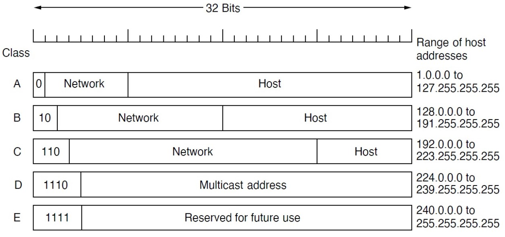
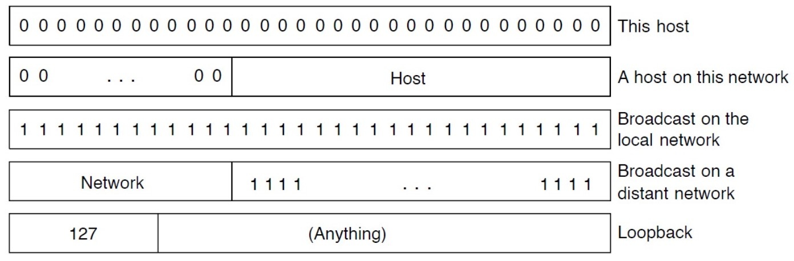
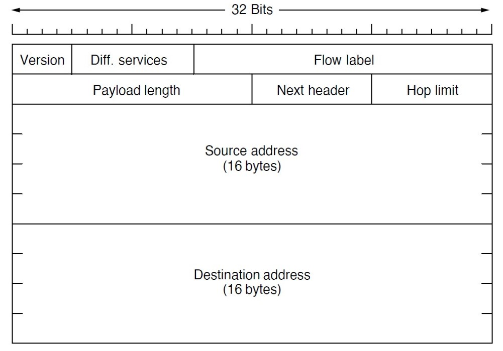
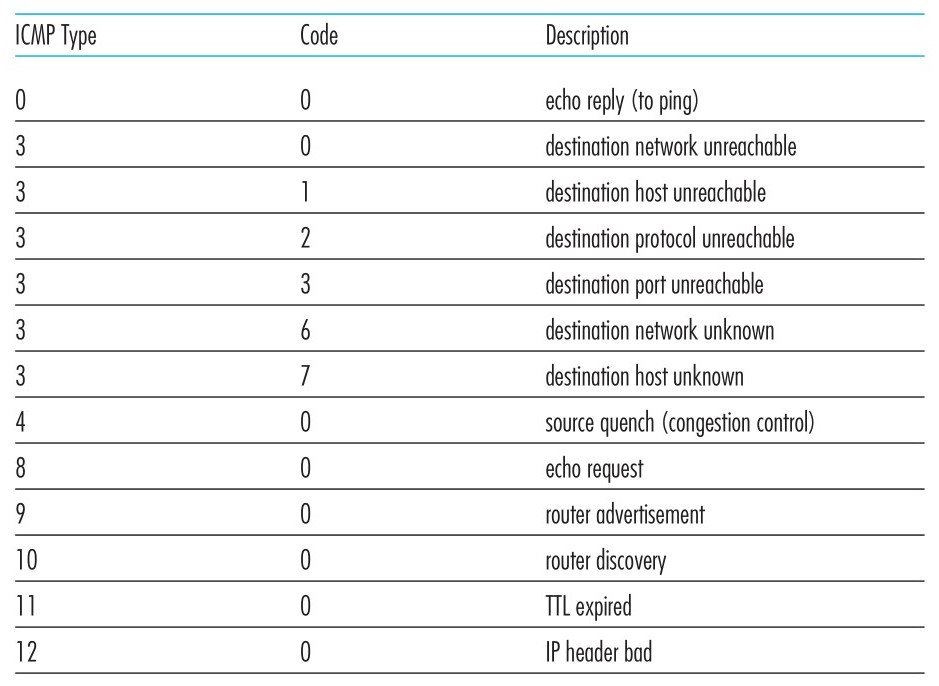
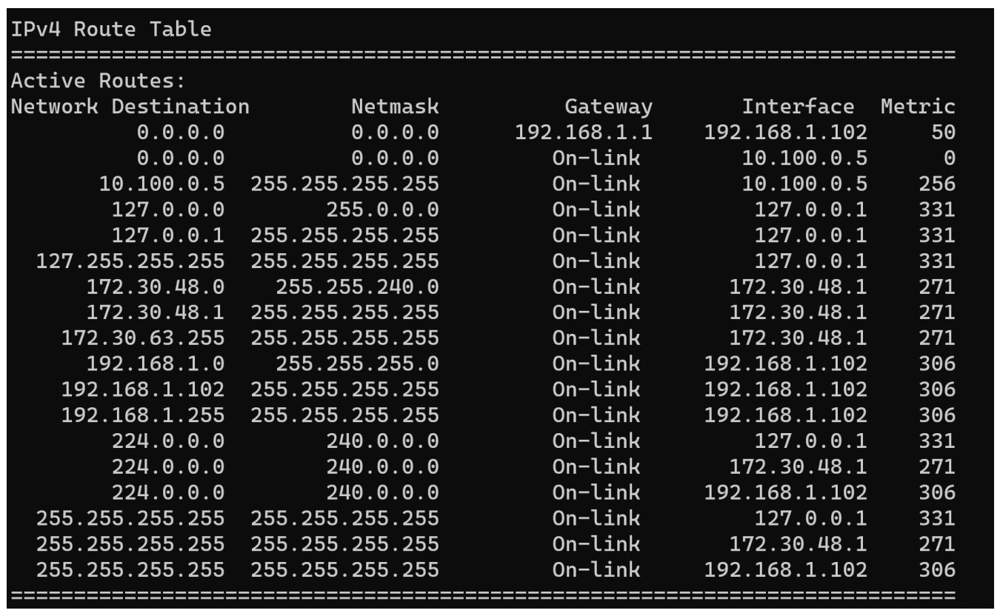

# Confefencia #4 Capa de red

La capa de red se encarga de:

1. **Enrutamiento**: determinar la ruta más eficiente para que los paquetes de datos lleguen desde el origen hasta el destino. Esto implica la selección de la ruta más corta a través de la red, teniendo en cuenta factores como el número de saltos, la carga de la red y la disponibilidad de la ruta.
2. **Direccionamiento**: asignar direcciones únicas a los dispositivos en la red. Estas direcciones, conocidas como direcciones IP (Protocolo de Internet), permiten que los paquetes de datos sean enviados a la ubicación correcta dentro de la red.
3. **Segmentación y Reensamblaje de Paquetes**: La capa de red se encarga de dividir los datos en segmentos más pequeños que pueden ser transmitidos a través de la red y luego reensamblarlos en el destino. Esto es necesario porque los dispositivos en una red pueden tener diferentes capacidades de transmisión y tamaños de paquete, y la segmentación permite que los datos se transmitan de manera eficiente.
4. **Gestión de Tráfico**: La capa de red también juega un papel en la gestión del tráfico de red, asegurando que los datos se transmitan de manera eficiente y equitativa. Esto incluye la implementación de políticas de control de flujo para evitar la sobrecarga de la red y la implementación de mecanismos de control de congestión para gestionar el tráfico de red en situaciones de alta demanda.

## Direcciones IPv4

Existen $2^{32}$ posibles direcciones, que se dividen en 4 bytes (cada uno representa un numero entre 0 y 255), con lo que las direcciones serian de la forma `192.168.43.1`.

Las direcciones `IPv4` tienen una mascara que consiste de un numero de 32 bits con un prefijo de $d$ bits todos puestos en $1$ y los demas en $0$. El prefijo representa la direccion de la red mientras que el resto representa la direccion de un host en particular.

### Jerarquia de direcciones

### Direcciones especiales

## Objetivos de la invencion de IPv6

1. Soporte para miles de millones de direcciones
2. Reducir el tamaño de las tablas de rutas
3. Simplificar el protocolo para ganar en velocidad de procesamiento
4. Proveer mejor seguridad
5. Prestar mas atención al tipo de servicio. Datos en tiempo real
6. Soporte para multicast
7. Roaming sin cambiar direcciones ip
8. Permitir que el protocolo evolucione con el futuro
9. Coexistencia de ambas versiones del protocolo

Las direcciones en este protocolo consisten de `16bytes` ($2^128$ direcciones), se expresan como un conjunto de numeros hexadecimales separados por `:`.

## Protocolos de control

* ICMP (Internet Control Message Protocol): se utiliza por hosts y routers para compartir informacion a nivel de capa de red entre ellos. Su uso mas comun es para reporte de errores.
* ARP (Address Resolution Protocol):  se utiliza para mapear una dirección IP a una dirección física (MAC) en una red local. Cuando un dispositivo necesita enviar un paquete a otro dispositivo en la misma red local, pero solo conoce la dirección IP del destino, ARP se utiliza para obtener la dirección MAC correspondiente. Esto es necesario porque las redes Ethernet, por ejemplo, utilizan direcciones MAC para la comunicación directa entre dispositivos.
* DHCP (Dynamic Host Configuration Protocol): permite a los dispositivos en una red obtener automáticamente una dirección IP y otra información de configuración de red, como la dirección del servidor DNS y la máscara de subred, de un servidor DHCP. Esto elimina la necesidad de configurar manualmente estas configuraciones en cada dispositivo, facilitando la administración de la red y permitiendo que los dispositivos se conecten dinámicamente a la red sin necesidad de intervención manual.

## Algoritmos de enrutamiento

Un algoritmo de enrutamiento debe cumplir que sea correcto, estable, robusto, estable, justo y eficiente.

* Correctitud: Un algoritmo de enrutamiento debe ser capaz de determinar la ruta más eficiente para que los paquetes de datos lleguen desde el origen hasta el destino sin errores. Esto significa que debe ser capaz de seleccionar la ruta correcta a través de la red, teniendo en cuenta factores como el número de saltos, la carga de la red y la disponibilidad de la ruta.
* Simplicidad: La simplicidad es crucial para la implementación y mantenimiento de los algoritmos de enrutamiento. Un algoritmo simple es más fácil de entender, implementar y depurar. Además, la simplicidad puede reducir la complejidad de la red, lo que puede mejorar la eficiencia y la escalabilidad.
* Robustez: Un algoritmo de enrutamiento robusto debe ser capaz de manejar cambios en la red, como la adición o eliminación de nodos, la falla de enlaces o la congestión de la red. Debe ser capaz de adaptarse a estos cambios y encontrar rutas alternativas cuando sea necesario.
* Estabilidad: La estabilidad se refiere a la capacidad del algoritmo de enrutamiento para mantener las rutas de los paquetes de datos sin cambios innecesarios. Un algoritmo estable minimiza la cantidad de cambios en las rutas, lo que puede reducir la sobrecarga de la red y mejorar la eficiencia de la transmisión de datos.
* Justicia: La justicia en el enrutamiento se refiere a la capacidad del algoritmo de enrutamiento para distribuir el tráfico de manera equitativa entre los nodos de la red. Un algoritmo justo asegura que todos los nodos tengan acceso a la red y que el tráfico se distribuya de manera que no se sobrecargue ningún nodo.
* Eficiencia: La eficiencia se refiere a la capacidad del algoritmo de enrutamiento para encontrar rutas que minimicen el tiempo de transmisión de los paquetes de datos. Un algoritmo eficiente selecciona rutas que maximizan la velocidad de transmisión y minimizan el uso de recursos de la red.

### Protocolos de enrutamiento

* RIP (Routing Information Protocol): protocolo de enrutamiento dinámico que utiliza el algoritmo de distancia de vecino más corto (Shortest Path First, SPF) para calcular las rutas más eficientes entre los nodos de la red. RIP es conocido por su simplicidad y es ampliamente utilizado en redes pequeñas y medianas. Sin embargo, RIP tiene limitaciones en términos de escalabilidad y capacidad para manejar redes más grandes debido a su dependencia de la actualización periódica de la información de enrutamiento. Utiliza el algoritmo de Bellman-Ford, vectores de distancia y saltos para calcular la ruta mas eficiente (no es lo mas eficiente). Se envian las tablas de ruta completas las cuales se actualizan utilizando broadcast.
* OSPF (Open Shortest Path First): protocolo de enrutamiento dinámico que también utiliza el algoritmo SPF para calcular las rutas más eficientes. A diferencia de RIP, OSPF es más escalable y puede manejar redes más grandes de manera más eficiente. OSPF utiliza un enfoque de estado de enlace, donde cada router mantiene una tabla de estado de enlace que describe el estado de los enlaces a otros routers. Esto permite a OSPF actualizar rápidamente la información de enrutamiento en caso de cambios en la red. Utiliza el algoritmo de Dijkstra por lo que es mas eficiente. Envia actualizaciones modulares e incluye sistemas de seguridad. Demanda mas procesamiento de CPU.
* BGP (Border Gateway Protocol): protocolo de enrutamiento externo que se utiliza para intercambiar información de enrutamiento entre sistemas autónomos (AS). A diferencia de los protocolos de enrutamiento internos como OSPF, que operan dentro de una única red, BGP es crucial para la conectividad entre diferentes redes en Internet. BGP utiliza un enfoque de política de enrutamiento basado en políticas de acceso y preferencias de ruta para determinar las rutas más eficientes para el tráfico entre AS. Esto permite a BGP manejar la complejidad y la escalabilidad de Internet, donde hay millones de routers y redes.

