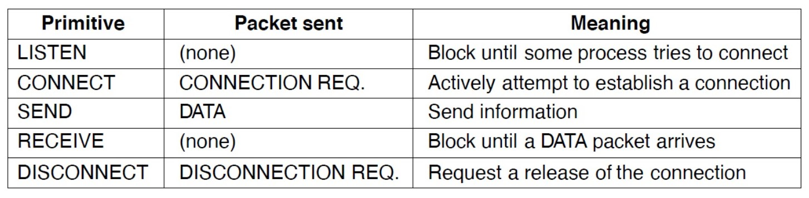
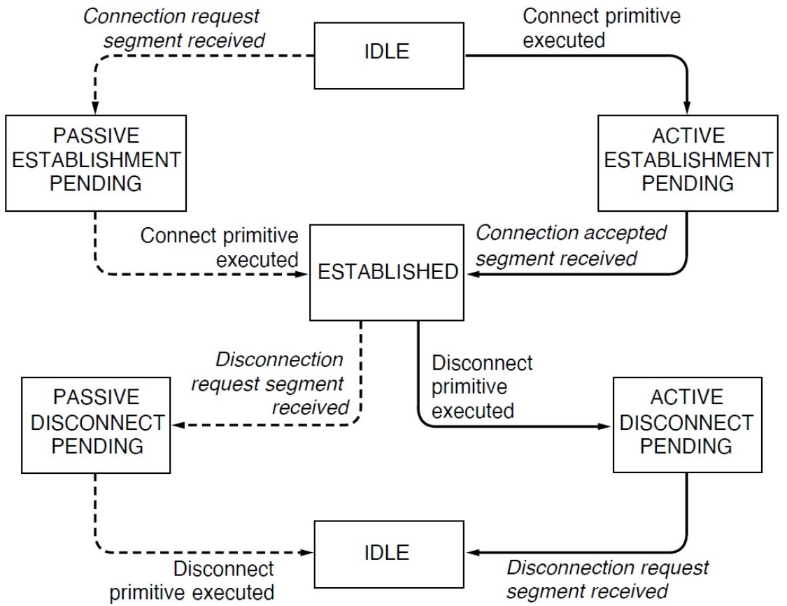

# Conferencia #5 Capa de transporte

La capa de transporte se encarga de:

1. **Segmentación y Reensamblaje de Datos**: La capa de transporte se encarga de dividir los datos en segmentos más pequeños que pueden ser transmitidos a través de la red y luego reensamblarlos en el destino. Esto es necesario porque los dispositivos en una red pueden tener diferentes capacidades de transmisión y tamaños de paquete, y la segmentación permite que los datos se transmitan de manera eficiente.

1. **Control de Flujo**: Esta capa implementa mecanismos de control de flujo para evitar que un transmisor muy rápido sature a un receptor lento. Esto se logra mediante el uso de señales de control que indican al receptor cuántos datos puede aceptar en un momento dado, permitiendo así una comunicación equilibrada y eficiente.

1. **Detección y Corrección de Errores**: La capa de transporte utiliza técnicas como el chequeo de paridad, el checksum y el CRC (Cyclic Redundancy Check) para detectar y, en algunos casos, corregir errores que pueden ocurrir durante la transmisión de datos. Esto asegura que los datos sean transmitidos de manera confiable y sin alteraciones.

1. **Gestión de Sesiones**: Esta capa es responsable de establecer, mantener y terminar sesiones entre dispositivos. Esto incluye la negociación de parámetros de comunicación, como el tamaño de la ventana de control de flujo y la velocidad de transmisión, y la sincronización de los datos transmitidos.
1. **Seguridad**: La capa de transporte también puede proporcionar mecanismos de seguridad para proteger los datos transmitidos. Esto puede incluir el cifrado de los datos para asegurar que solo los dispositivos autorizados puedan acceder a ellos.

## Sockets

Un socket es un punto final de comunicación entre dos procesos que se ejecutan en la misma máquina o en diferentes máquinas en una red. Los sockets proporcionan una interfaz de programación de aplicaciones (API) para la comunicación entre procesos, permitiendo que los datos se envíen y reciban a través de la red o entre procesos en el mismo sistema.

La creación y gestión de sockets implica operaciones como la creación de un socket, la vinculación de un socket a una dirección IP y puerto, la escucha de conexiones entrantes (en el caso de los sockets de servidor), la conexión a un servidor (en el caso de los sockets de cliente), el envío y recepción de datos, y finalmente, el cierre del socket cuando la comunicación ha terminado.

### Operaciones basicas de un socket

El funcionamiento interno de un socket puede ser descrito como una maquina de estados determinista de la siguiente manera

### 3-way handshake

El 3-way handshake es un proceso que se utiliza en las conexiones TCP (Transmission Control Protocol) para establecer una conexión entre dos hosts en una red. Este proceso garantiza que ambos hosts estén listos para la comunicación y que se hayan establecido correctamente los parámetros necesarios para la transmisión de datos. El 3-way handshake consta de tres pasos principales:

1. **SYN (Sincronización)**: El primer paso es que el host que desea iniciar la conexión (el cliente) envía un paquete SYN al host con el que desea comunicarse (el servidor). Este paquete contiene un número de secuencia inicial (ISN) que el cliente elige al azar.

1. **SYN-ACK (Sincronización-Acknowledgement)**: En respuesta al paquete SYN, el servidor envía un paquete SYN-ACK al cliente. Este paquete contiene su propio ISN y también un número de confirmación (ACK) que es el ISN del cliente más uno, indicando que está listo para recibir datos.

1. **ACK (Acknowledgement)**: Finalmente, el cliente envía un paquete ACK al servidor para confirmar que ha recibido el paquete SYN-ACK. Este paquete ACK contiene el número de secuencia inicial del cliente más uno, indicando que está listo para enviar datos.

Una vez que se completa el 3-way handshake, la conexión TCP está establecida y ambos hosts pueden comenzar a enviar y recibir datos.

### UDP(User Datagram Protocol)

 Es un protocolo de transporte que se utiliza en las redes de computadoras para enviar datos de manera rápida y eficiente, sin establecer una conexión previa entre el emisor y el receptor, lo que lo hace más ligero y rápido que otros protocolos de transporte como TCP.

Las características básicas de UDP incluyen:

1. **Sin Conexión**: A diferencia de TCP, UDP no establece una conexión antes de enviar datos. Esto significa que no hay un proceso de handshake de tres vías (3-way handshake) para establecer la conexión. Los datos se envían directamente al receptor sin confirmar que el receptor está listo para recibirlos.

1. **Sin Control de Flujo**: UDP no implementa mecanismos de control de flujo, lo que significa que no regula la velocidad a la que se envían los datos para evitar sobrecargar al receptor. Esto puede llevar a la pérdida de paquetes si el receptor no puede procesar los datos a la misma velocidad que se envían.

1. **Sin Control de Congestión**: Al igual que TCP, UDP no tiene mecanismos incorporados para manejar la congestión de la red. Esto significa que UDP puede enviar datos a una velocidad que puede sobrecargar la red o el receptor, lo que puede resultar en la pérdida de paquetes.

1. **Sin Garantía de Entrega**: UDP no garantiza la entrega de los paquetes de datos. No hay confirmación de que los paquetes lleguen al destino, lo que significa que los paquetes pueden perderse durante la transmisión.

1. **Sin Orden de Entrega**: Los paquetes de datos enviados por UDP pueden llegar al receptor en un orden diferente al que fueron enviados. Esto es diferente de TCP, que garantiza que los paquetes se entreguen en el orden correcto.

1. **Simplicidad**: Debido a su naturaleza sin conexión y sin control de flujo, UDP es más simple que TCP. Esto lo hace adecuado para aplicaciones que requieren velocidad y eficiencia, como el streaming de video y audio, juegos en línea y servicios de tiempo real.

### TCP(Transmission Control Protocol)

Es un protocolo de transporte que se utiliza en las redes de computadoras para enviar datos de manera confiable y ordenada entre dos hosts. Proporciona una serie de servicios que garantizan la entrega de datos, incluyendo la confirmación de la entrega, el control de flujo, el control de congestión y la detección y corrección de errores.

Las características básicas de TCP incluyen:

1. **Conexión Orientada**: TCP establece una conexión entre el emisor y el receptor antes de que los datos puedan ser transmitidos. Esto se realiza mediante un proceso de handshake de tres vías (3-way handshake) que garantiza que ambos hosts estén listos para la comunicación.

1. **Control de Flujo**: TCP implementa mecanismos de control de flujo para evitar que un transmisor muy rápido sature a un receptor lento. Esto se logra mediante el uso de ventanas de control de flujo y números de secuencia para controlar la cantidad de datos que se pueden enviar sin una confirmación previa.

1. **Control de Congestión**: TCP tiene mecanismos incorporados para manejar la congestión de la red. Esto incluye el uso de temporizadores y la reducción de la tasa de transmisión cuando se detecta congestión, lo que ayuda a mantener la red eficiente y evitar la pérdida de paquetes.

1. **Garantía de Entrega**: TCP garantiza la entrega de los paquetes de datos. Utiliza números de secuencia y confirmaciones de entrega para asegurar que cada paquete llegue al destino y en el orden correcto. Si un paquete se pierde durante la transmisión, TCP tiene mecanismos para retransmitir el paquete.

1. **Orden de Entrega**: TCP garantiza que los paquetes de datos se entreguen en el orden en que fueron enviados. Esto se logra mediante el uso de números de secuencia y confirmaciones de entrega.

1. **Detección y Corrección de Errores**: TCP utiliza técnicas como el chequeo de paridad y el checksum para detectar errores en los datos transmitidos. Si se detecta un error, TCP puede corregirlo o, en algunos casos, retransmitir el paquete.

1. **Fiabilidad**: Debido a sus mecanismos de control de flujo, control de congestión, garantía de entrega y detección de errores, TCP es un protocolo de transporte confiable que es adecuado para aplicaciones que requieren la entrega segura y ordenada de datos.
