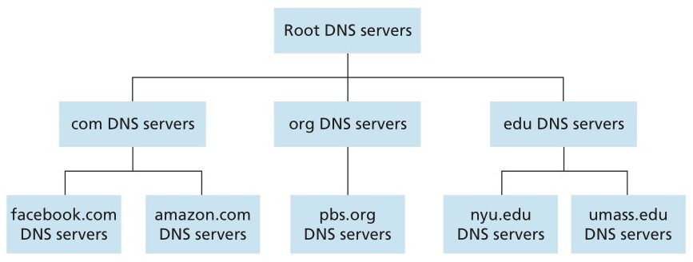

# Conferencia #6 Capa de aplicacion

La capa de aplicación en las redes de computadoras es la capa más cercana al usuario y es responsable de proporcionar servicios de red a las aplicaciones de software. Esta capa actúa como intermediario entre las aplicaciones y los protocolos de red, permitiendo que las aplicaciones utilicen los servicios de red sin tener que preocupar por los detalles de implementación de los protocolos de bajo nivel.

## DNS(Domain Name Service)

Supongamos que un usuario desea acceder al servicio alojado en la direccion `189.55.16.7`, de conocerla puede simplemente acceder a ella. Sin embargo si esta direccion se asignase de forma dinamica o se cambiase a la hora de acceder a dicho servicio probablemente ya no estaria alojado en dicha direccion. Para resolver esto utilizaremos el protocolo DNS que permite mapear nombres descriptivos con ip's de servicios en internet sin que los usuarios tengan que conocer dichas direcciones directamente. El puerto usado por DNS es 53(UDP). Este protocolo utiliza una estructura arborea de forma distribuida para almacenar direcciones de internet de la siguiente manera:

## SMTP(Simple Mail Transfer Protocol)

Se utiliza para la transferencia de correos electronicos; utiliza el puerto 25(TCP)

## HTTP(Hyper Text Transfer Protocol)

Se utiliza para la transferencia de hipermedios (hipertexto) a traves de los puertos 80(sin TLS) y 443(con TLS) y siempre usando el protocolo TCP

## FTP (File Transfer Protocol)

Se utiliza para la transferencia de archivos, a traves de los puertos 20 y 21(TCP).

## IRC

Se utiliza para mensajeria basada en texto. Utiliza el puerto 6667(TCP)

## SSH

Para la ejecucion de una consola remota. Puerto 22(TCP).

## NTP

Para la sincronizacion de hora. Puerto 123(UDP).